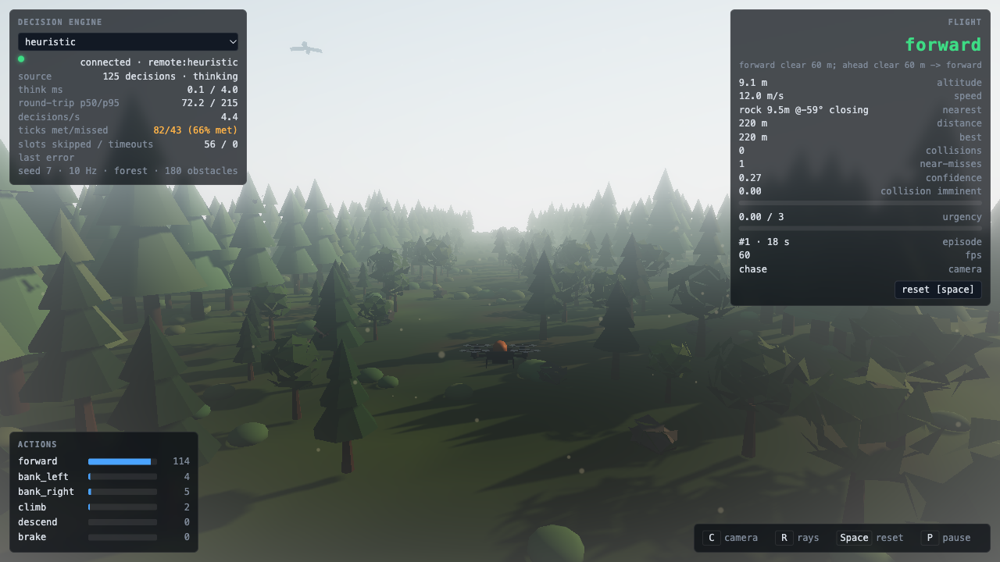
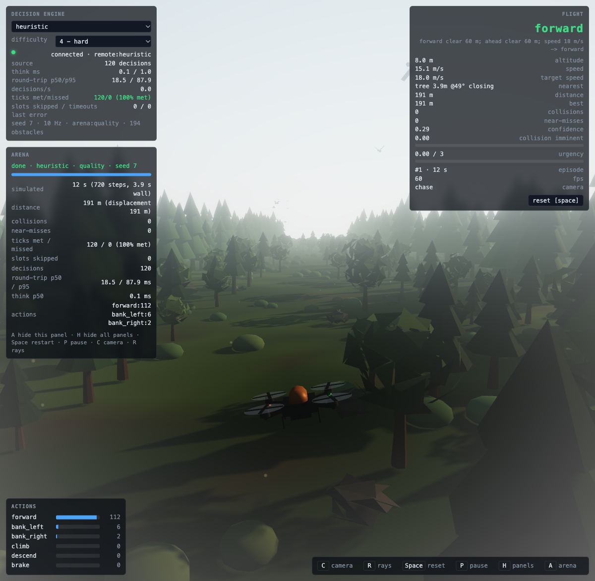
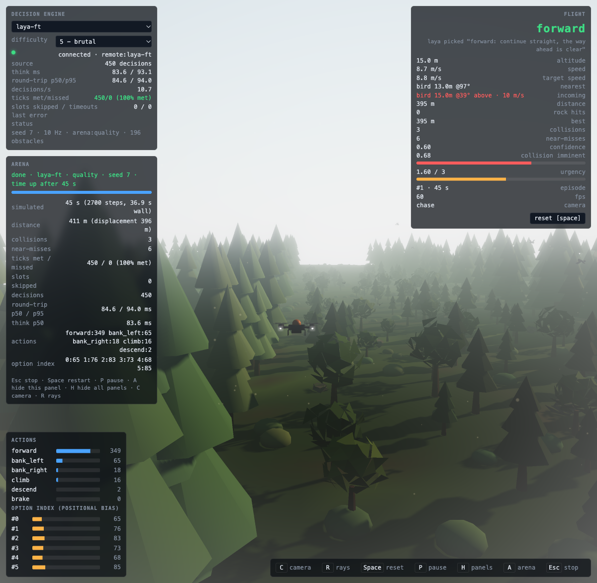
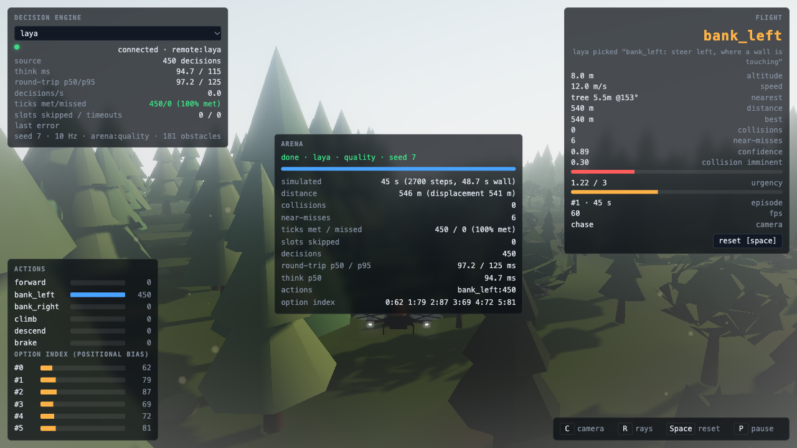

# Drone Forest

A 3D simulator for testing what a decision model can do when it has to fly. A quadcopter flies
down an endless forest corridor of trees, rocks and birds; every 100 ms the game builds a
`SensorFrame` (11 raycasts + drone state) and asks a **decision source** for one of six actions.
The game never decides anything itself. One source talks over WebSocket to a Python
microservice whose engine can be **Laya** (the open-weights decision model), a **geometric
heuristic**, or **random**; another source runs the heuristic in the browser so the game plays
with no server at all.

The point is measurement, not a demo: the three engines fly the *same* seeded forest, at the
same cadence, through the same protocol, and the numbers below are what came out. Laya is a
zero-shot base model that was never trained on this task; it is expected to fly into trees, and
it does. Every decision it makes is recorded with the full frame, so the simulator doubles as a
data generator for a future fine-tune.



## Architecture

Dependency inversion at every seam. Nothing depends on a concrete engine, obstacle or
behaviour; each of those is one new module plus one registration line.

```
   browser (Three.js + Vite + TypeScript)                       Python (FastAPI + uvicorn)
 ┌──────────────────────────────────────────────┐             ┌──────────────────────────────┐
 │ main.ts  (the only file that names concretes) │             │ server/app.py                │
 │   ┌────────┐  ┌─────────┐  ┌────────┐         │   WebSocket │   /ws  /decide  /health      │
 │   │ world  │─▶│ sensors │─▶│decision│──────────────────────▶│   /engines  /stats  /event   │
 │   │        │  │ raycast │  │  loop  │◀──────────────────────│         │                    │
 │   └───┬────┘  └─────────┘  └───┬────┘  Decision│  frame /    │         ▼  DecisionEngine    │
 │       │ Spawner                │ DecisionSource│  decision   │   engines/base.py (Protocol) │
 │       ▼ (core/types)           ▼ (core/types)  │  envelopes  │   ┌──────────┬──────────┐    │
 │  obstacles/                decision/           │             │   │heuristic │ random   │    │
 │   registry ──▶ ObstacleFactory ┐ remote.ts ────┘             │   ├──────────┴──────────┤    │
 │      tree / rock / bird        │ local.ts (in-browser)       │   │ laya_engine.py       │    │
 │   ObstacleBehavior ◀───────────┘   heuristic)                │   │  framing.py (semantic│    │
 │      static / random-wander / (your AI policy)               │   │  options, shuffled)  │    │
 │                                                              │   └──────────┬───────────┘    │
 │  drone/  model + kinematics + chase cam        hud/          │              ▼ telemetry.py   │
 └──────────────────────────────────────────────┘             │      data/telemetry-*.jsonl  │
                                                                └──────────────────────────────┘
   contracts (frozen, mirrored field for field):
     web/src/core/types.ts  ⇄  server/schemas.py        (SensorFrame, Decision, GameEvent, PROTOCOL_VERSION)
     web/src/core/rays.ts   ⇄  server/schemas.py RAY_SPEC (the 11-ray fan, in order)
```

The seams:

| seam | interface | who depends on it | concrete implementations |
|---|---|---|---|
| where decisions come from | `DecisionSource` (`core/types.ts`) | `decision/loop.ts`, `main.ts` | `RemoteEngineSource` (WebSocket), `LocalHeuristicSource` |
| what an engine is | `DecisionEngine` (`server/engines/base.py`) | `server/app.py` | `heuristic_engine`, `random_engine`, `laya_engine` |
| what an obstacle is | `Obstacle`, `ObstacleFactory`, `Spawner` | `world/`, `drone/` (collision), `sensors/` (rays) | `TreeFactory`, `RockFactory`, `BirdFactory`, `ForestSpawner` |
| how an obstacle moves | `ObstacleBehavior` | `obstacles/base.ts` | `StaticBehavior`, `RandomWanderBehavior` |

## Running it

Requirements: Python 3.12 with [uv](https://docs.astral.sh/uv/), Node 20+, the Laya checkpoint in
the local Hugging Face cache (`convaiinnovations/laya`, subfolder `english`), and the Laya source
checked out at `../upstream` (`make upstream` in the repo root). Apple Silicon (MPS) or CUDA for
the model; CPU works but is slow.

```bash
make setup      # uv sync --group dev && npm install
make dev        # service on :8765 in the background, game on :5173 in the foreground
# or separately:
make serve      # uvicorn server.app:app --host 127.0.0.1 --port 8765
make web        # vite dev server
make test       # pytest (88 tests; the Laya ones skip when the checkpoint is not cached)
make lint       # ruff + tsc
make build      # production bundle in web/dist
make arena      # prints the benchmark URLs
make evaluate   # prints the ONE URL that runs the whole evaluation matrix (engines x levels x seeds x modes)
make scoreboard # aggregates every recorded arena result into the good-and-fast table
make telemetry  # summarises the newest data/telemetry-*.jsonl
make clean
```

Open `http://127.0.0.1:5173/?engine=heuristic&seed=7`. If the service is not running the game
logs a warning and flies on the in-browser heuristic.

Switching engines from the panel is confirmed by the service before it takes effect. The
engine panel's **status** line tells you what is going on: *loading laya…* while a model warms
up (a few seconds; longer if the GPU is busy), or *service unreachable — flying on the built-in
heuristic* if nothing answers on `:8765`. In that second case the game keeps the connection
attempt alive and **adopts the engine you selected automatically** the moment the service comes
up — start it with `make serve` and watch the panel switch over.

### URL parameters

| param | values | meaning |
|---|---|---|
| `engine` | `heuristic` (default), `laya`, `random`, `local` | remote engine name, or the in-browser heuristic |
| `seed` | int (default 1) | world seed; the same seed is the same forest for every engine |
| `hz` | 1..60 (default 10) | decision cadence |
| `corridor` | `forest` (default), `canyon`, `open` | corridor half-width 24 / 12 / 40 m |
| `seconds` | number | play: episode length, 0 (default) = fly until a collision, then a new episode; arena: run length, **0 (default) = endless** — fly until the first collision or `Esc`, results shown when it ends |
| `difficulty` | 1..5 | obstacle preset: 1 sparse, 3 normal (default), 5 dense with a narrow wandering gap — see *Difficulty and speed* |
| `seeds` | `A-B` | arena only: chain runs over seeds A..B, reloading with `seed+1` after each result — one URL collects a whole batch |
| `arena` | `quality`, `realtime` | run the benchmark instead of playing (see below) |
| `server` | ws url | decision service, default `ws://127.0.0.1:8765/ws` |

Keys: `C` chase / nose camera, `R` sensor rays on/off, `Space` reset, `P` pause. The HUD's
engine selector switches engines live (a new connection, a fresh episode).

`window.__droneForest` exposes `state()`, `stats()`, `config`, `arenaResult` and the
`arenaDone` promise, which is how the numbers below were read out of a headless browser.

### Service environment

`DEFAULT_ENGINE` (heuristic), `PORT` (8765), `TELEMETRY_DIR` (`data/`), `LAYA_CHECKPOINT`
(`english`), `LAYA_DEVICE` (`auto` → cuda > mps > cpu), `FRAMING` (`semantic` | `numeric`),
`SHUFFLE_OPTIONS` (true), `LAYA_SEED` (0), `RANDOM_ENGINE_SEED` (0). See `server/config.py`.

## Difficulty and speed

### Difficulty levels

`difficulty=1..5` (URL) or the selector in the engine panel (play mode) picks a spawner preset.
Every level keeps the flyability guarantee — each obstacle row leaves a clear gap whose centre
random-walks from row to row — but the rows get closer, denser, the gap narrower and its drift
per row larger:

| level | row spacing | clear gap half-width (start → after 1.5 km) | gap drift / row | density |
|---:|---:|---|---:|---:|
| 1 sparse | 7.0 m | 6.0 → 4.5 m | 1.2 m | 0.35 |
| 2 easy | 6.4 m | 5.4 → 4.0 m | 1.7 m | 0.51 |
| 3 normal | 5.8 m | 4.8 → 3.5 m | 2.2 m | 0.68 |
| 4 hard | 5.1 m | 4.1 → 3.0 m | 2.7 m | 0.84 |
| 5 brutal | 4.5 m | 3.5 → 2.5 m | 3.2 m | 1.00 |

Level 5 is deliberately tuned so a path *always* exists (the gap never closes below 2.5 m
half-width against a 0.6 m drone) but cannot be followed at full speed: 3.2 m of lateral drift
between rows 4.5 m apart is more than 7 m/s of lateral speed can cover at 18 m/s forward. It can
be followed at the engine's minimum speed. So the challenge is not just *which way* — the engine
has to trade speed for safety.

Measured with the heuristic engine, quality arena, 45 s, 16 seeds per level:

| level | collisions / run | near-misses / run | banking decisions / 450 | mean speed |
|---:|---:|---:|---:|---:|
| 3 | 0.63 | 4.7 | ~35 | 12.2 m/s* |
| 4 | 0.75 | 8.0 | ~65 | 15.2 m/s |
| 5 | 0.69 | 10.4 | ~85 | 14.8 m/s |

\* level-3 runs were recorded before the speed policy existed (cruise 12 m/s); with it the same
seed-115 forest went from 546 m to **708 m** in 45 s at one collision. Collisions barely rise with
level because the heuristic slows down; near-misses and banking are where the difficulty shows.

### Ogres (protocol 3)

Brute ogres stand on the ground and throw rocks at the drone. They are the first *hostile*
obstacle, and they were added entirely through the extension seam: `factories/ogre.ts` (the
creature and its `SpawnProfile`), `factories/projectile.ts` (the thrown rock),
`behaviors/ogre-thrower.ts` (when and how to throw) and `behaviors/ballistic.ts` (gravity and
landing) — plus one `registerFactory` line. Two additive fields on `WorldContext` made it
possible: `difficulty`, so a behaviour can scale itself live, and `emit(obstacle)`, so a
behaviour can put something new into the world mid-flight. The sensor contract gained the kinds
`ogre` and `projectile`; Laya's prompt calls them *an ogre* and *a thrown rock*.

An ogre faces the drone, and when it is inside range (but never closer than 14 m — a
point-blank rock is undodgeable) it winds up (the arm goes back, a telegraph both the sensors and
a human can see) and releases a rock at where the drone is *going to be*: a closed-form
low-arc ballistic solution (`behaviors/ballistics.ts`, unit-checked) with the intercept point
iterated for the drone's velocity. Everything that makes it dangerous scales with the level:

| level | range | throw every | rock speed | aim error | lead |
|---:|---:|---:|---:|---:|---:|
| 1 | 35 m | 5.0 s | 12 m/s | 12° | 0 (aims at where you are) |
| 3 | 50 m | 3.7 s | 17 m/s | 7.5° | 0.43 |
| 5 | 65 m | 2.4 s | 22 m/s | 3° | 0.85 (aims at where you will be) |

The spawner's per-level density scaling applies on top, so level 5 fields roughly three times as
many ogres as level 1 (capped at four alive).

Two things had to change for rocks to be *dodgeable* rather than merely visible:

* **`nearest` now ranks by time-to-collision, not distance.** A rock 20 m out closing at 30 m/s
  (0.7 s away) matters more than a tree 10 m out at 12 m/s (0.8 s). `distance`, `bearing`,
  `elevation` and `closing_speed` mean what they always did; only *which* obstacle is reported
  changed. Static scenery still wins whenever nothing is closing faster than the drone itself.
* **The heuristic dodges.** When `nearest.kind` is `projectile` and it is closing inside a 2 s
  window, the escape directions get a bonus (up if it comes from below, sideways away from its
  bearing) and `forward` a penalty. It is keyed on the *kind*: an earlier version keyed on closing
  speed treated every tree approached at full throttle as a rock and flew the whole forest weaving
  at 9 m/s — measured, and fixed.

The HUD shows **rock hits** separately; arena results carry `collisions_by_kind`.

Measured (quality arena, 45 s, seeds 7–9, this build):

| engine | level | collisions | of which rocks | near-misses | distance | mean speed |
|---|---:|---:|---:|---:|---:|---:|
| heuristic (dodges) | 3 | 0, 0, 0 | 0 | 2, 3, 1 | 746 / 679 / 731 m | 15.1–16.6 m/s |
| heuristic (dodges) | 5 | 0, 0, 0 | 0 | 6, 1, 3 | 698 / 686 / 685 m | 15.2–15.5 m/s |
| `laya-ft` (v2) | 5 | **3** | **3** | 6 | 411 m | 9.2 m/s |

The reference pilot survives level 5 at full pace by climbing and banking out of the way (climbs
per run went from ~2 to 6–17). The fine-tuned model does not: every one of its collisions was a
rock, none a tree — it was trained on telemetry recorded before ogres existed, from a teacher
that could not dodge, so there is nothing in its data about incoming objects. That is the point
of the ogres: a hazard the current checkpoint measurably cannot handle, and a clean next
experiment — collect again with the dodging teacher, fine-tune, and see whether the `Incoming:`
line in the prompt is enough for it to learn to climb.

Balance history, since it is easy to get wrong: the first tuning (26 m/s rocks, 1° error, full
lead, 1.6 s cadence) hit the *heuristic* five times in 42 s — impossible. The first dodge, keyed
on closing speed, made every tree approached at full throttle look like a rock and the drone flew
level 5 weaving at 9 m/s. The current numbers are the third iteration.

### Engine-recommended speed (protocol 2)

Every `Decision` may carry `target_speed` (m/s, in `[SPEED_MIN=4, bounds.speed_max=18]`), and
the drone tracks it through the same first-order lag as its actions; `null` means cruise. The
`SensorFrame.bounds` now carries `speed_max` so an engine knows the ceiling.

* **heuristic** — full speed whenever nothing is within 30 m in the front cone, scaled down to
  the floor by 8 m, and never faster than keeps 2.5 s of time-to-collision to whatever the
  forward ray (or a closing bird) sees; `brake` forces the floor.
* **laya** — a fourth question in the same forward pass: a 4-level `score` (*crawl / slow /
  fast / full speed*) mapped linearly onto the band. Zero-shot it is as unreliable as its
  steering; it is one of the four labels the fine-tune learns.
* **random** — uniform over the band.

The HUD shows `target speed` next to actual speed; arena results carry `mean_speed` and
`max_speed`.

### Keys

`C` camera (chase / nose) · `R` sensor rays · `P` pause (play and arena) · `Space` reset (in an
arena: restart the run) · `H` hide/show every panel · `A` hide/show the arena panel. The arena
results panel stacks directly under the decision-engine panel, so it never overlaps the
other panels or covers the drone; `A` dismisses it.





## The wire protocol

JSON over one WebSocket per game client (`/ws?engine=<name>`), envelopes defined in
`server/schemas.py` and mirrored in `web/src/core/types.ts`:

```
client → server   {"type":"frame",      "frame": SensorFrame}
                  {"type":"event",      "event": GameEvent}        collision | near_miss | reset | engine_switch | score
                  {"type":"set_engine", "engine": "laya"}
server → client   {"type":"info",       "engine": "laya", "engines": [...], "protocol": 1}
                  {"type":"decision",   "decision": Decision}
                  {"type":"error",      "message": "..."}          malformed input; the socket stays open
```

`info` is sent on connect only after the requested engine is loaded and warm, so the game never
flies blind through a model load; it is sent again as the acknowledgement of `set_engine`. The
client keeps exactly one frame in flight and the server keeps at most one frame waiting per
connection (a newer frame replaces an older one), so a slow engine loses decision slots instead
of building a queue. `decision.latency_ms` is the engine's own think time; the game measures the
round trip separately, so network cost and model cost are never confused.

A `SensorFrame` carries the drone state (position, velocity, heading, altitude, speed), the
eleven rays `forward, left_15, right_15, left_30, right_30, left_45, right_45, left_60, right_60,
up (+35°), down (−35°)` (each: distance to first hit or `max_range` 60 m, and the kind hit:
`tree | rock | bird | ground | wall | null`), the nearest obstacle with bearing, elevation and
closing speed, the altitude bounds and the last action. A `Decision` carries `action`,
`engine`, `frame_id`, `decision_id`, `latency_ms`, and, when the engine has them, `confidence`,
`probabilities`, `collision_imminent`, `urgency`, `reason`, `option_index` and `option_order`
(the last two exist so positional bias can be audited). There is also plain HTTP:
`POST /decide {frame, engine?}`, `GET /health`, `GET /engines`, `GET /stats`, `POST /event`.

## How Laya is asked

`server/engines/framing.py` renders the frame as short English (distance words, sector
labels, altitude and speed words) and each of the six actions as `label: consequence`, where the
consequence is derived from the rays in that action's sector ("bank_left: steer left, where a
tree is close"). One `predict()` asks three questions in one forward pass: a `choice` for the
move, a `noul` (calibrated yes/no) for collision-imminent and a `score` (0..3) for urgency. The
option order is shuffled per frame (seeded by `frame_id`) so a slot preference cannot masquerade
as a policy; `option_index` records where the chosen option was. The engine returns Laya's
argmax and nothing else: it never imports the heuristic, applies no safety override, and does
not re-rank. `FRAMING=numeric` sends the raw metres instead, for A/B comparison. All six
options fit in 80 of the 192 head tokens (checked by a test).

## Evaluation protocol: how good and how fast is Laya?

The simulator exists to answer one question — *can Laya, as the decision engine, fly the drone
through the forest, past the birds and the ogres' rocks, and how fast can it decide?* — and this
protocol is how it is answered. Everything else in this README (the play mode, the HUD, the
difficulty levels) exists to make the runs believable and repeatable.

**Two axes, measured separately.**

- *Good* — quality-mode arena: the world is stepped at a fixed 1/60 s and every decision is
  awaited, so latency cannot cost the engine a single tick. What is left is the policy: how many
  collisions per run, how many of them are thrown rocks, near-misses, distance flown and the
  speed the engine chose. Same seeds, same forests, same ogres for every engine.
- *Fast* — realtime-mode arena on the same seeds: the wall clock runs, decisions are asked at
  10 Hz; a request whose answer arrives inside its 100 ms slot is *met*, one that arrives
  later is *missed* (it is still applied when it lands — nothing is queued — and slots that pass
  while a request is in flight are counted separately as skipped). `ticks met` is met / (met +
  missed). An engine that decides well but slowly shows up here as missed ticks and a worse
  outcome than its own quality-mode row. `think p50` is the engine's own synchronised inference
  time.

**One URL runs the whole matrix.** `make evaluate` prints it (engines × levels × seeds × modes,
defaults `EVAL_ENGINES=heuristic,laya,laya-ft,random EVAL_LEVELS=3,5 EVAL_SEEDS=7-8
EVAL_SECONDS=45`); the page runs each cell, reports its `ARENA_RESULT` to the service as a
`score` event and reloads itself with the next combination (`web/src/decision/matrix.ts`, seed
innermost, then level, engine, mode) until it logs `ARENA_MATRIX_DONE`. Leave the tab alone while
it runs — realtime cells are timing measurements. `make scoreboard` then aggregates every
recorded result per (mode, engine, level); re-running a cell replaces its earlier result, so
the table always reflects the latest build. The heuristic is the ceiling (it is the teacher,
and it sees the same frame), `random` the floor.

### Scoreboard, build 1: `laya-ft` v2 (trained before ogres existed)

Measured 2026-09-24 on an Apple M4 Max (MPS), headless Chromium via Playwright, GPU otherwise
idle. 45 simulated seconds per cell, 10 Hz decisions, difficulty 3 and 5, seeds 7–8 — two seeds
per cell, so read the columns as a smoke test of each engine, not a benchmark with error bars
(`EVAL_SEEDS=7-16` is the same protocol with ten). `think p50` is the engine's own synchronised
inference time; `ticks met` only means something in realtime mode.

| mode | engine | level | runs | collisions/run | rock hits/run | near-misses/run | distance | speed | ticks met | think p50 |
|---|---|---:|---:|---:|---:|---:|---:|---:|---:|---:|
| quality | `heuristic` | 3 | 9 | 0.33 | 0.00 | 3.8 | 915 m | 16.1 m/s | 100% | 0 ms |
| quality | `heuristic` | 5 | 2 | 0.00 | 0.00 | 3.5 | 692 m | 15.4 m/s | 100% | 0 ms |
| quality | `laya` | 3 | 2 | 1.00 | 0.00 | 5.5 | 582 m | 12.9 m/s | 100% | 87 ms |
| quality | `laya` | 5 | 2 | 2.50 | 0.00 | 16.0 | 599 m | 13.3 m/s | 100% | 143 ms |
| quality | `laya-ft` | 3 | 2 | 1.50 | 0.00 | 5.0 | 411 m | 9.2 m/s | 100% | 125 ms |
| quality | `laya-ft` | 5 | 2 | 2.00 | 2.00 | 6.0 | 415 m | 9.2 m/s | 100% | 123 ms |
| quality | `random` | 3 | 2 | 3.50 | 0.00 | 9.0 | 452 m | 10.1 m/s | 100% | 0 ms |
| quality | `random` | 5 | 2 | 8.50 | 1.50 | 36.0 | 452 m | 10.1 m/s | 100% | 0 ms |
| realtime | `heuristic` | 3 | 2 | 0.00 | 0.00 | 0.5 | 718 m | 16.0 m/s | 100% | 0 ms |
| realtime | `heuristic` | 5 | 2 | 1.00 | 0.00 | 10.0 | 669 m | 14.9 m/s | 100% | 0 ms |
| realtime | `laya` | 3 | 2 | 1.00 | 0.00 | 9.5 | 590 m | 13.1 m/s | 93% | 89 ms |
| realtime | `laya` | 5 | 2 | 3.50 | 1.50 | 14.5 | 592 m | 13.2 m/s | 24% | 150 ms |
| realtime | `laya-ft` | 3 | 2 | 0.00 | 0.00 | 5.5 | 364 m | 8.1 m/s | 0% | 173 ms |
| realtime | `laya-ft` | 5 | 2 | 1.00 | 0.00 | 6.5 | 376 m | 8.4 m/s | 1% | 130 ms |
| realtime | `random` | 3 | 2 | 6.50 | 0.50 | 23.5 | 448 m | 10.0 m/s | 100% | 0 ms |
| realtime | `random` | 5 | 2 | 9.00 | 0.00 | 26.5 | 446 m | 10.0 m/s | 100% | 0 ms |

What it says, in order of importance:

- **Good — trees.** The fine-tune reads the forest: at level 3 `laya-ft` v2 hits nothing in
  realtime mode and 1.5 things per run in quality mode, between zero-shot Laya (1.0) and random
  (3.5); at level 5 it hits 2.0 per run against zero-shot 2.5 and random 8.5. The heuristic
  it was taught by hits 0.0 on the same seeds, so the gap to the teacher is still wide.
- **Good — rocks.** Every level-5 quality-mode collision of `laya-ft` v2 is a thrown rock
  (2.0 rock hits/run) while zero-shot Laya, which cannot dodge either, took 0.0: v2 flies low
  and slow (9.2 m/s versus 13–15) and the ogres' lead-aimed throws are easiest against exactly
  that. v2 was trained on 23.6k frames recorded **before ogres existed** — it has never seen an
  `Incoming: a thrown rock` line. That is the next fine-tune's job (v3, below), and it is why
  the training set is collected with the dodging teacher at levels 3–5.
- **Fast.** Laya's think time is 87 ms p50 at level 3 and 143–150 ms at level 5, because the
  prompt grows with the scene (more rays report hits, the incoming-object line appears). At the
  10 Hz the drone asks, that is 93% of ticks met at level 3 and 24% at level 5 for zero-shot
  Laya, and 0–1% for `laya-ft`. The `laya-ft` latencies in this first table (123–173 ms) are
  inflated: on identical frames the two checkpoints measure the same to within 1 ms through
  `/decide` (94.1 vs 93.6 ms on a level-5 frame), and the difference came from CPU work this
  author ran on the same machine during those cells — the build-2 table below was taken with
  the machine quiet. A decision that misses its slot is still applied when it arrives, so the
  realtime rows degrade gracefully rather than collapse — but on this GPU Laya is a 7–11 Hz
  pilot, not a 10 Hz one, and the honest way to run it faster is a shorter prompt or a smaller
  checkpoint, not a faster loop.
- **Speed choice.** The heuristic cruises at 15–16 m/s; `laya-ft` v2 picks 8–9 m/s. Its speed
  answers agree with the teacher on 82% of validation frames, but the 18% it gets wrong are the
  "go fast, it is clear" frames, and a slow drone is what makes rocks land.

### Scoreboard, build 2: `laya-ft` v3 (trained on the world it is tested in)

Same protocol, same seeds, same 45 s. The `heuristic` and `random` rows are build 1's (they do
not use the GPU and their decisions do not depend on the checkpoint); the `laya` and `laya-ft`
rows were re-run with v3 in the `laya-ft` slot. Zero-shot `laya` makes identical decisions to
build 1 in quality mode — the protocol is deterministic — which is the check that the two
tables are comparable.

| mode | engine | level | runs | collisions/run | rock hits/run | near-misses/run | distance | speed | ticks met | think p50 |
|---|---|---:|---:|---:|---:|---:|---:|---:|---:|---:|
| quality | `heuristic` | 3 | 2 | 0.00 | 0.00 | 2.5 | 713 m | 15.9 m/s | 100% | 0 ms |
| quality | `heuristic` | 5 | 2 | 0.00 | 0.00 | 3.5 | 692 m | 15.4 m/s | 100% | 0 ms |
| quality | `laya` | 3 | 2 | 1.00 | 0.00 | 5.5 | 582 m | 12.9 m/s | 100% | 109 ms |
| quality | `laya` | 5 | 2 | 2.50 | 0.00 | 16.0 | 599 m | 13.3 m/s | 100% | 125 ms |
| quality | `laya-ft` | 3 | 2 | 1.00 | 0.00 | 8.5 | 612 m | 13.6 m/s | 100% | 125 ms |
| quality | `laya-ft` | 5 | 2 | 2.50 | 1.50 | 10.5 | 611 m | 13.6 m/s | 100% | 127 ms |
| quality | `random` | 3 | 2 | 3.50 | 0.00 | 9.0 | 452 m | 10.1 m/s | 100% | 0 ms |
| quality | `random` | 5 | 2 | 8.50 | 1.50 | 36.0 | 452 m | 10.1 m/s | 100% | 0 ms |
| realtime | `heuristic` | 3 | 2 | 0.00 | 0.00 | 0.5 | 718 m | 16.0 m/s | 100% | 0 ms |
| realtime | `heuristic` | 5 | 2 | 1.00 | 0.00 | 10.0 | 669 m | 14.9 m/s | 100% | 0 ms |
| realtime | `laya` | 3 | 2 | 2.50 | 0.00 | 11.0 | 595 m | 13.2 m/s | 97% | 87 ms |
| realtime | `laya` | 5 | 2 | 2.50 | 1.00 | 11.5 | 581 m | 12.9 m/s | 23% | 192 ms |
| realtime | `laya-ft` | 3 | 2 | 0.50 | 0.00 | 2.5 | 630 m | 14.1 m/s | 0% | 192 ms |
| realtime | `laya-ft` | 5 | 2 | 3.00 | 1.00 | 11.0 | 558 m | 12.5 m/s | 0% | 125 ms |
| realtime | `random` | 3 | 2 | 6.50 | 0.50 | 23.5 | 448 m | 10.0 m/s | 100% | 0 ms |
| realtime | `random` | 5 | 2 | 9.00 | 0.00 | 26.5 | 446 m | 10.0 m/s | 100% | 0 ms |

What changed, and what did not:

- **Speed.** v3 chose 13.6 m/s where v2 chose 9.2, and flew 611 m per run where v2 flew 411 —
  50% faster and 50% further, at the heuristic's 15.5 m/s minus a margin. That is the speed
  question's 0.60 → 0.78 agreement showing up as flight.
- **Trees.** 1.0 collisions per run at level 3 in quality mode (v2: 1.5, zero-shot: 1.0,
  heuristic: 0.0) and 0.5 in realtime; at level 5, 1.0 tree per run (v2: 0.0, but v2 was
  crawling through the dense band at 9 m/s).
- **Rocks.** Level-5 rock hits went 2.0 → 1.5 per run in quality mode and 2.0 → 1.0 in realtime
  — while flying 50% faster, which the ogres' lead-aimed throws punish less. v3 has now seen
  3,119 teacher dodges (tripled in training) and agrees with the teacher on 66% of held-out
  dodge frames (v2: 59%); it dodges *more* than v2, not yet *reliably*. The teacher takes 0.0
  rock hits on the same seeds.
- **Net.** At level 5 in quality mode v3's total is 2.5 collisions per run against v2's 2.0 —
  the trade is one tree for half a rock and a much faster, longer flight. A fine-tune that
  moves the steering question from 0.54 to 0.60 agreement moves the arena this much; closing the
  gap to the heuristic (0.0) needs the steering question to move a lot further, and the honest
  finding of three fine-tunes is that the state-reading questions learn in an epoch and the
  6-way steering choice learns slowly.
- **Fast, measured on a loaded machine.** During the build-2 realtime cells the machine's
  1-minute load average was 4–8 with excursions to 94 from a Time Machine backup and a
  container VM outside this project (sampled every 30 s during the run). The three cells that
  ran at load < 6 — zero-shot `laya` level 3 seeds 7–8 and level 5 seed 7 — measured 83, 91
  and 101 ms think p50 and met 99%, 94% and 33% of their 10 Hz slots; the cells that ran through
  the spike measured 114–284 ms and met almost none. The same level-5 frame measured 94 ms
  through `/decide` with the machine quiet and 164 ms at load 15. Read the realtime rows with
  that in mind: on this GPU, quiet, Laya answers this prompt in 85–125 ms depending on how much
  of the scene is occupied, so it is a 8–12 Hz decision engine at level 3 and slips under
  10 Hz at level 5. A missed slot is not a lost decision (it is applied when it arrives), which
  is why the realtime outcomes stay close to the quality-mode ones.

**Bottom line for the question the simulator was built to answer.** Laya *can* fly the drone
autonomously in this world once fine-tuned on it — v3 completes every 45 s run at 13–14 m/s,
covers 600 m and takes 1–2.5 collisions per run where random takes 3.5–9 and the teacher
takes 0 — and it decides in ~90–125 ms per frame on an M4 Max, which is at the edge of a 10 Hz
loop. What it is *not yet* is safe: it hits a tree a run and is still hit by rocks at level 5.
Every number above comes from `make evaluate` + `make scoreboard` and can be reproduced,
extended to more seeds (`EVAL_SEEDS=7-16`) or re-run after the next fine-tune with the same
two commands.

<!-- SCOREBOARD-V3 -->

## Arena: the numbers

`?arena=quality&seconds=45&engine=<e>&seed=<s>` steps the world at a fixed 1/60 s, asks at 10 Hz
and **waits for every answer** (latency removed, only the policy measured), then prints one
`ARENA_RESULT {json}` line to the console and shows the same table in the HUD. `arena=realtime`
keeps the wall clock so slow engines lose slots exactly as they do in play.

Measured 2026-09-22 on an Apple M4 Max (MPS), headless Chromium 1280×720 via Playwright,
Laya `english` checkpoint, semantic framing, shuffled options, 45 simulated seconds = 450

> **Load caveat.** Every latency in this section was measured while the GPU was shared with an
> unrelated 35B-parameter llama.cpp server and the load average sat between 80 and 460. On a
> quiet machine the same three-question Laya pass measures 55–60 ms (see *The one-frame probe*
> below) and single-question calls 20–35 ms. The *decisions* — which action Laya picks — do not
> depend on load; only the timings do.
decisions per run. Two seeds, run once each; these are single runs, not a benchmark.

| engine | seed | distance | collisions | near-misses | actions | think p50 / p95 | round-trip p50 / p95 |
|---|---|---|---|---|---|---|---|
| heuristic | 7 | 543 m | **1** | 4 | forward 407, bank_left 20, bank_right 21, climb 2 | 0.02 ms | 0.5 / 1.0 ms |
| heuristic | 3 | 544 m | **0** | 3 | forward 405, bank_left 24, bank_right 19, climb 2 | 0.02 ms | 0.5 / 1.0 ms |
| laya | 7 | 546 m | **0** | 6 | **bank_left 450** | 94.7 / 115 ms | 97.2 / 125 ms |
| laya | 3 | 557 m | **4** | 17 | **bank_left 418**, bank_right 32 | 94.1 / 110 ms | 96.4 / 110 ms |
| random | 7 | 488 m | **6** | 17 | uniform (66..86 each) | 0 ms | 0.4 / 0.8 ms |
| random | 3 | 495 m | **1** | 4 | uniform (65..88 each) | 0 ms | 0.7 / 1.8 ms |

Laya's option-index histogram over the 900 decisions was flat (seed 7: 62/79/87/69/72/81; seed 3:
59/75/91/67/76/82 across slots 0..5), so the constant `bank_left` is a label preference, not the
slot-0 bias seen in earlier Tetris experiments.



How to read this, honestly:

- **Laya (zero-shot) is a constant-action predictor here.** Given real game frames it answers
  `bank_left` 96–100 % of the time regardless of what the rays say (the service-side probe with
  hand-built frames in `tests/test_laya_engine.py` got `forward` 32/32 on a different frame
  distribution; either way the input barely moves the output). The drone drifts to the left wall
  of the corridor (it is clamped at x = −24 m) and rides it. Seed 7 happened to have nothing on
  that wall for 540 m: zero collisions by luck of the seed, and seed 3 shows the other side of
  that coin (4 collisions, 17 near-misses). Nothing was tuned to produce or hide this; changing
  the framing to hide it would be rigging the comparison.
- **Distance is not a skill metric in this corridor.** Forward speed is fixed at 12 m/s unless
  the engine brakes, so every non-braking policy flies ~540 m in 45 s; random covers less only
  because it brakes 15 % of the time. Collisions and near-misses are the numbers that matter.
- **The heuristic is the ceiling the simulator can currently show**, not an oracle: it collided
  once in 90 s. The in-browser `local` heuristic is a port of the same idea, not line-for-line
  identical (see limitations).
- **Latency.** Laya's think time was 87–99 ms p50 in every run on this machine while a separate
  `llama-server` was using the same GPU and the load average was ~400; the engine's author
  measured 57–80 ms p50 on the same hardware idle. The brief's 20–35 ms is for a single-question
  `predict()`; this engine asks three questions per pass on ~200-token inputs. Round trip minus
  think time was 1–3 ms. In play mode at 10 Hz Laya therefore met 53–55 % of its slots (the rest
  were answered late and counted as missed, or skipped while a frame was in flight); the
  heuristic met 100 % in the arena and 66 % in play mode on this loaded machine, where the
  browser's own 60 fps render loop was the bottleneck (p50 round trip 70 ms with a 0.1 ms
  engine; 0.5 ms in the arena, where the page renders once per simulated second).
- **`collision_imminent` carries some signal** (0.30–0.70 on the HUD in the Laya runs, higher
  with a tree close) even though the move choice does not; it is reported, not used.

Play-mode numbers from the same session (realtime, 10 Hz, seed 7, every episode restarts the
same forest): Laya **33 collisions in 89.5 s** of simulated flight — 33 episodes, every one ending
in a collision, mean 2.7 s of flight each, 539 decisions at 107 ms think p50, 5 of 14 slots met
in the last episode; an earlier 17 s sample of the same run had 4 collisions across 5 episodes.
The heuristic had 0 collisions in 17 s (119 decisions, 66 % of slots met on this loaded machine);
the local heuristic 1 collision in 21 s (203 decisions, 100 % met). Play mode is harsher on Laya
than the quality arena because its ~110 ms answers arrive after the 100 ms slot has passed: each
is applied late and the next slot is skipped, so it steers at ~5 Hz through a forest that was
tuned for 10 Hz. That is the real-time cost of a 421M-parameter encoder, measured, not modelled.

### Fine-tuned: `laya-ft` in the arena

Same forests, same protocol (quality mode, 45 s, difficulty 3), the only change being the
checkpoint. Zero-shot rows are from the section above.

| engine | seed | distance | collisions | near-misses | actions | mean speed |
|---|---:|---:|---:|---:|---|---:|
| `laya` zero-shot | 7 | 546 m | 0 | 6 | bank_left 450 | 12.0 m/s* |
| `laya` zero-shot | 3 | 557 m | 4 | 17 | bank_left 418, bank_right 32 | 12.0 m/s* |
| `laya-ft` (v2) | 7 | 390 m | **1** | 4 | forward 99, bank_left 107, bank_right 232, climb 11, descend 1 | 8.7 m/s |
| `laya-ft` (v2) | 3 | 447 m | **1** | 2 | forward 92, bank_left 215, bank_right 131, climb 11, descend 1 | 9.9 m/s |
| heuristic | 7 | 543 m | 1 | 4 | forward 407, banks 41, climb 2 | 12.0 m/s* |
| heuristic | 3 | 544 m | 0 | 3 | forward 405, banks 43, climb 2 | 12.0 m/s* |

\* recorded before the speed policy existed (cruise 12 m/s); `laya-ft` chooses its own speed.

What changed is the *shape* of the decisions, not yet the outcome. Zero-shot Laya was a
constant-action predictor; v2 spreads its choices across forward, both banks and climb with a
flat option-index histogram, so it is responding to the scene. It flies slowly (it picks low
speed levels) and weaves, and its collision counts sit between zero-shot Laya and the
heuristic on these two seeds — two seeds are a smoke test, not a benchmark. It is not yet an
autonomous pilot; it is the first checkpoint whose behaviour depends on what the sensors say.

### The one-frame probe (reproduce it in ten seconds)

With the service running (`make serve`), `make probe` posts a single hand-built frame — a tree
**6 m dead ahead**, the whole left side **clear for 60 m** — and prints what each engine decides.
`scripts/tree_ahead_frame.json` is the frame; edit it and re-run.

```
$ make probe ENGINE=heuristic
  heuristic  bank_left   P=0.393  conf=0.39  think=0.1 ms   -- forward tree 6 m; left clear 60 m -> bank_left
$ make probe ENGINE=laya
  laya       forward     P=0.996  conf=0.98  think=63.9 ms  -- laya picked "forward: continue straight into a tree that is close"
```

That second line is the whole finding in one row. The option Laya chose carries its own
consequence in plain words — *continue straight into a tree that is close* — and it still picks
it at **P = 0.996**, reporting confidence 0.98. The option order was shuffled (`forward` sat in
slot 3 of 6), so this is not the slot-0 bias seen in the parent repo's Tetris scenario; it is a
label preference the sensor text does not move. Zero-shot, this checkpoint is not reading the
scene. That is exactly what the telemetry it writes is for: `data/*.jsonl` pairs every frame with
the action taken and the engine that took it, which is the training set a fine-tune of this
checkpoint would learn from.

## Telemetry → fine-tuning dataset

Every service run appends to `data/telemetry-<UTC>.jsonl`, flushed on every write:

```
{"kind":"decision","ts":"2026-09-23T05:26:31.020+00:00","engine":"laya","frame":{...full SensorFrame...},"decision":{...full Decision...}}
{"kind":"event","ts":"...","engine":"laya","event":{"type":"collision","frame_id":168,"t":16.8,"obstacle_kind":"tree","details":{...}}}
```

`make telemetry` (`python -m server.telemetry [file]`) recomputes per-engine decision counts,
latency percentiles, action and option-index histograms, collisions and near-misses from the
file; `GET /stats` gives the same numbers live.

Because every record carries the full frame, the file is a self-contained dataset. The recipe
for a Laya fine-tune that this repo makes possible (it has **not** been done here):

1. Take every `decision` record, whatever engine produced it; the frames are the data, the
   engine that saw them does not matter.
2. Label each frame with the heuristic as teacher: `HeuristicEngine().decide(frame, 0).action`
   (`server/engines/heuristic_engine.py`), and drop frames whose `score`/`collision` events show
   the teacher itself crashed within the next second.
3. Render the frame and the options exactly as the engine does at inference —
   `framing.build_prompt(frame, "semantic", shuffle=True, seed=...)` — so the training text and
   the serving text are the same function; the target is the index of the teacher's action in
   `prompt.order`.
4. Train Laya's `choice` head on those (state, options, index) triples, and its `noul` head on
   "collision within 1 s" from the event records.

Step 1 is why the arena records Laya's own frames too: a fine-tuned model must be tested on the
states *it* gets itself into, not only on the heuristic's.

## Teaching it to fly: the fine-tune loop

> **Continuing this work?** Read [`FINETUNING.md`](FINETUNING.md) first: the exact commands
> and results of v1–v3, the knob reference, the pitfalls, and the ranked list of what to try
> for v4. This section is the overview; that document is the handoff.

Zero-shot, no way of asking the question makes Laya fly (`make eval-offline` scores every
formulation against the heuristic on recorded frames — a 6-way `choice`, five per-direction
`noul` questions, five ordinal `score` questions, semantic and numeric renderings — and all of
them land near chance on the frames that matter). That is what upstream says too: the base
checkpoints are a base to fine-tune. The simulator is built to close that loop:

1. **Collect.** `make serve`, `make web`, then open the chained arena URL (`make collect` prints
   it): the heuristic flies 24 seeds × levels 3, 4 and 5 × 60 s in quality mode. With the GPU
   free that is about a second per run, so the 72 runs take a few minutes and yield ~40,000
   teacher-flown frames with ogres and thrown rocks in them (the `Incoming:` line, and the
   teacher's dodges). Add a few `engine=laya-ft` runs on the same URL shape afterwards: frames
   from the student's own flight path (slow, weaving, in the dense band) are relabelled by the
   teacher, which is the DAgger-style correction a purely teacher-flown dataset lacks.
2. **Label.** `server/dataset.py` re-runs the heuristic on every recorded frame, whoever was
   flying, so frames Laya crashed on get the same consistent label. Exact duplicates collapse.
   A label-ceiling check (identical prompt → majority label) puts the best any text-reader can do
   on the semantic framing at **0.967** on danger frames, so the information is in the prompt.
3. **Train.** `make finetune` — supervised, multi-task on the *same four questions* the engine
   asks at inference, built with laya's own `build_sequence` so train and serve see byte-identical
   prompts; option order re-shuffled per example per epoch so it cannot learn a slot; balanced
   sampling (each epoch is half danger frames); a block-wise train/val split so neighbouring
   frames never straddle it; the encoder frozen by default (`FINETUNE_ARGS="--unfreeze-top 2"`
   trains the top encoder layers at a lower learning rate); best epoch saved atomically in
   laya's own checkpoint layout. Big datasets are kept affordable with `--epoch-examples N`
   (cap the balanced epoch so the schedule and the wall clock stay predictable) and
   `--val-examples N` (a capped validation set that keeps every rock-dodge frame first, then
   other danger frames, then forward); `--dodge-repeat K` oversamples the rare frames where the
   teacher dodges a thrown rock; `--base data/checkpoints/<dir>` continues from an earlier
   fine-tune instead of the stock checkpoint, and the lineage is recorded in the checkpoint's
   `fine_tuned_from`. The validation report carries a `rock_agree` slice — agreement with the
   teacher on exactly those dodge frames — so "did it learn to dodge" is a number, not a feeling.
4. **Serve.** The `laya-ft` engine is the unchanged `LayaEngine` pointed at that checkpoint —
   one module, one registration line — so an arena difference between `laya` and `laya-ft` is
   the fine-tune and nothing else.

Results so far (balanced 80-per-class sample of recorded frames, agreement with the teacher on
frames where it does *not* say forward):

| checkpoint | danger agreement | chooses `forward` on danger |
|---|---:|---:|
| base `english`, zero-shot | 0.42 | 0.29 |
| v1: head only, 2 epochs, 2.3k frames | 0.34 | 0.38 |
| v2: top-2 encoder layers, 23.6k frames, 3 epochs | 0.42 | 0.27 |

v1 made things worse — a frozen encoder plus a small stale dataset drifted toward `forward`.

v3 continued from v2 (`--base data/checkpoints/laya-drone-ft`) on 80,189 frames — the v2 data
plus 72 teacher-flown runs at levels 3–5 with ogres and 9 `laya-ft` v2 student runs — with the
rock-dodge frames tripled (`--dodge-repeat 3`), 2 capped epochs of 6,000 balanced examples
(1,000 steps, 60 minutes on the M4 Max) and a 1,200-frame validation set that keeps every
rock-dodge frame (400) and 400 other danger frames, so it is a *harder* validation set than
v2's, not a comparable one. On it, before → after:

| question (v3 validation set, 800 of 1,200 frames are danger frames) | v2 | v3 |
|---|---:|---:|
| move — agreement with the teacher on danger frames | 0.535 | **0.598** |
| move — agreement on the 400 frames where the teacher dodges a thrown rock | 0.59 | **0.66** |
| move — says `forward` on danger frames (lower is better) | 0.28 | **0.26** |
| collision imminent (yes/no) | 0.63 | **0.87** |
| urgency (4 levels) | 0.61 | **0.77** |
| speed (4 levels) | 0.60 | **0.78** |

The same shape again: the state-reading questions recover quickly on the new distribution, the
steering question moves a few points. The arena is the test that matters (*Evaluation
protocol*, build 2).

v2 (top 2 encoder layers unfrozen, 23,602 frames across difficulty levels 3–5, ~114 minutes on
the M4 Max) shows exactly where a supervised fine-tune bites and where it does not. On the
held-out block split (4,800 frames, 989 of them danger frames):

| question | base, zero-shot | v2 fine-tuned |
|---|---:|---:|
| collision imminent (yes/no) | 0.32 | **0.87** |
| urgency (4 levels) | 0.03 | **0.85** |
| speed (4 levels) | 0.20 | **0.82** |
| move — agreement with the teacher on danger frames | 0.57 | **0.61** |
| move — says `forward` on danger frames (lower is better) | 0.37 | **0.29** |

The three *state-reading* questions go from chance to strong in under three epochs: the model
learns to read the rendered scene. The *steering* question moves in the right direction but
only modestly — it is a harder, multi-way decision that depends on relating six option texts to
the sector words in the state, and 3 epochs of a partial unfreeze is not enough to close the gap
to a heuristic that computes it exactly. The arena numbers below are the test that matters.

## Extending it

Each extension is one new file plus one registration line. The integrator checked this for the
three built-in kinds, the two behaviours and the three engines.

**A new obstacle kind** (say a drone swarm): create `web/src/obstacles/factories/drone-swarm.ts`
exporting a class that implements `SpawnableFactory` (`kind`, a `profile` describing layer,
density, radius, spacing and altitude band, `create(ctx, opts)` returning a `BaseObstacle`, and
`dispose()`), then add one line to `web/src/obstacles/registry.ts`:

```ts
registerFactory((o) => new DroneSwarmFactory(o));
```

The spawner places it from its profile; the world, drone, sensors and HUD need no change. If the
kind's *name* is new, it is also one word in the `ObstacleKind` union in `web/src/core/types.ts`
and in `server/schemas.py` (the frozen contract validates it on both sides).

**A new behaviour** (an AI flocking policy for birds): create
`web/src/obstacles/behaviors/flock-ai.ts` implementing `ObstacleBehavior` (`name`,
`update(obstacle, ctx)`; `ctx` gives it the drone position, the rng and the bounds), and change
the bird registration line to inject it:

```ts
registerFactory((o) => new BirdFactory({ ...o, behavior: (corridor) => new FlockAiBehavior(corridor) }));
```

A behaviour that wants to ask a model can hold its own `DecisionSource`-like client; nothing
else knows.

**A new engine** (server side): create `server/engines/my_engine.py` with a class satisfying
`DecisionEngine` (`name`, `warmup()`, `decide(frame, decision_id) -> Decision`, `describe()`)
and a factory decorated `@register("my")`, then add `"my_engine"` to `BUILTIN_MODULES` in
`server/engines/__init__.py`. It appears in `/engines`, `/health`, the WebSocket `info` message
and the HUD selector (add the name to `ENGINES` in `main.ts` to have it in the dropdown by
default; `?engine=` is validated against that list). `decide` must never raise — return `brake`
with a reason instead — and must report its own `latency_ms`.

**A new decision source** (browser side, e.g. HTTP or an in-page model): one module exporting a
class implementing `DecisionSource`, one export line in `web/src/decision/index.ts`, and the
selection in `openSource()` in `main.ts`.

## Layout

```
server/            FastAPI service            web/src/core/        frozen contracts (types, rays, rng)
  schemas.py       wire contract (frozen)     web/src/world/       renderer, sky, terrain, lighting, post-fx
  app.py           HTTP + WebSocket           web/src/drone/       model, kinematics, chase/nose camera
  telemetry.py     JSONL + stats + CLI        web/src/obstacles/   factories, behaviours, spawner, registry
  config.py        env → Settings             web/src/sensors/     ray fan → SensorFrame, ray debug view
  fastload.py      fast meta-device loader    web/src/decision/    remote / local sources, loop, arena
  engines/         base.py (Protocol),        web/src/hud/         DOM overlay
                   heuristic, random, laya    web/src/main.ts      wiring, URL params, window.__droneForest
tests/             pytest (71)                docs/                screenshots
```

## Known limitations

- Look: a stylised, lit, foggy low-poly forest with PCF-soft shadows, exponential haze, bloom,
  vignette and a primitive-built quadcopter with spinning rotors and blinking nav lights. It is
  not photoreal: no textures or normal maps, no SSAO, no volumetric light, no LOD. Performance
  was measured only headless at 1280×720, DPR 1: 60 fps with ~185 live obstacles.
- The drone never yaws; `bank_*` is lateral translation with a visual roll and every frame's
  heading is 0°. The corridor is straight along −Z. Hitting the corridor bounds is silent.
- Tree collision is one sphere at the canopy; a drone below ~2 m passes through the trunk.
  Ground and ceiling are altitude clamps, not collisions.
- The in-browser `local` heuristic and the server `heuristic` are the same design but not the
  same code; treat `local` as the offline fallback, not as a fourth engine in comparisons.
- Laya was probed with the `english` checkpoint only; `multilingual` and `typed-decisions`
  are selectable with `LAYA_CHECKPOINT` but were not measured. Laya's `confidence` is not
  P(correct) (it reported 0.92–0.99 on decisions that were wrong); `act_probability` is unused.
- Two seeds × 45 s is a smoke test of the measurement pipeline, not a benchmark; the random
  engine's seeded stream continues across runs within one service process, so its two runs are
  not replays of each other.
- All timing above was taken on a machine with a load average of ~400 and a busy GPU; expect
  lower latencies on an idle one, and the same policies.
- The service binds to loopback with CORS open to any origin; it is a local tool, not a
  deployable one.
